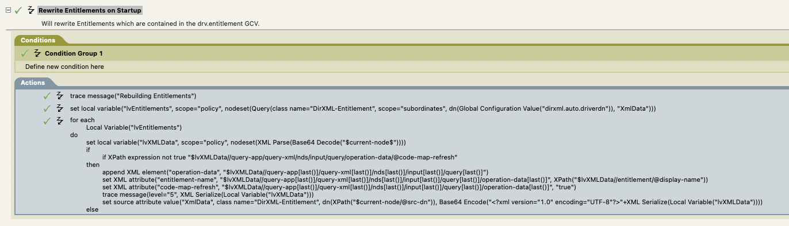

# Customizing Entitlement Queries

According to the Entitlement DTD (https://www.netiq.com/documentation/identity-manager- 47/entitlements/data/identity-manager-entitlement-dtd.html) it is possible to use a custom query for the entilement (code-map) refresh.

Meaning the entitlement query is already a ```<query/>```, but it is not possible to modify it in Designer – the added code (for example operation-data) will be stripped off (due to a Designer bug).

Once in a while it would be nice to be able to rewrite the code-map refresh, which is not possible without a workaround like this as it’s not possible to destinquise between a code-map query and a “normal” query.

## Entitlement

A group entitlement which contains a query looks like (example):

```xml
<entitlement conflict-resolution="priority" description="" display-name="Test">
    <values multi-valued="true">
        <query-app>
            <query-xml>
                <nds dtdversion="2.0">
                    <input>
                        <query class-name="Group" destdn="data\sys\groups" scope="subtree">
                            <search-class class-name="Group"/>
                            <read-attr attrname="Description"/>
                            <read-attr attr-name="CN"/>
                        </query>
                    </input>
                </nds>
            </query-xml>
            <result-set>
                <display-name>
                    <token-attr attr-name="CN"/>
                </display-name>
                <description>
                    <token-attr attr-name="Description"/>
                </description>
                <ent-value>
                    <token-src-dn/>
                </ent-value>
            </result-set>
        </query-app>
    </values>
</entitlement>
```

This will work just fine.

## Why modify the query

Once in a while it can be handy to able to modify the query result, but as we do not know that the query is from an code-map refresh we cannot intercept the query.

Adding something like this to the query, will allow us to identitfy where the query originates:
```xml
<operation-data code-map-refresh="true" entitlement-name="Groups"/>
```

Full query:
```xml
<query-xml>
    <nds dtdversion="2.0">
        <input>
            <query class-name="Group" dest-dn="data\sys\groups" scope="subtree">
                <search-class class-name="Group"/>
                <read-attr attr-name="Description"/>
                <read-attr attr-name="CN"/>
                <operation-data code-map-refresh="true" entitlementname="Groups"/>
            </query>
        </input>
    </nds>
</query-xml>
```

But as Designer strip off anything added to the entitlement it self, we need to add this in a startup policy - so that it will write the entitlement during driver startup.



This code will find all the entitlements for the Driver, and then add the ```<operation-data/>``` to the
entitlement query (if it’s not already there). Maybe there should be a check for the query it self – but
the example proves its point.

## The Entitlement Query Result

Now when the driver does it’s query it will add operation data to the instance node, which it is possible to check for and do some rewriting.

```xml
<instance class-name="Group" event-id="0" qualified-srcdn=" O=data\OU=sys\OU=groups\CN=test-group-14" src-dn="\mytree\data\sys\groups\testgroup-14" src-entry-id="33628">
    <attr attr-name="CN">
        <value naming="true" timestamp="1598645183#19" type="string">test-group-14</value>
    </attr>
    <operation-data code-map-refresh="true" entitlement-name="Groups"/>
</instance>
```

Notice the added ```<operation-data code-map-refresh="true" entitlement-name="Groups"/>```.