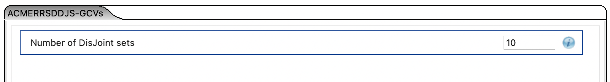
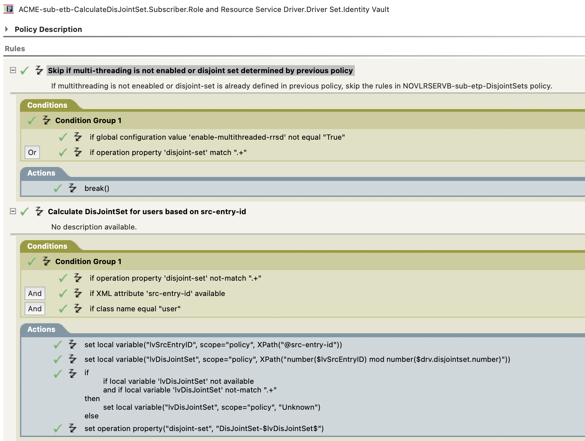

# Role and Resources Service Driver - DisJointSets

This is based on an idea from Lothar Häger, many people will use a letter from the CN or some other attribute, but depending on the country this will not be very random - or spread out.

Lothar described that he was using LocalEntryID which is a (almost) random number, doing a mod on that will give a possible random number so that the load will be spread out among the configured DisJointSets. 

### This is for user accounts only!!!

Create a GCV to to be able to configure the number of DisJointSets



```xml
<definitions>
	<definition critical-change="true" display-name="Number of DisJoint sets" name="drv.disjointset.number" range-hi="25" range-lo="0" type="integer">
		<description/>
		<value>10</value>
	</definition>
</definitions>
```

Then in the Subscriber Event Transformation add a policy (ACME-sub-etb-CalculateDisJointSet), make sure that it is being execute just after 'NOVLSERVB-sub-etp-Scoping', otherwise it will not do much.



```xml
<policy>
	<rule>
		<description>Skip if multi-threading is not enabled or disjoint set determined by previous policy</description>
		<comment xml:space="preserve">If multithreading is not eneabled or disjoint-set is already defined in previous policy, skip the rules in NOVLRSERVB-sub-etp-DisjointSets policy. </comment>
		<conditions>
			<or>
				<if-global-variable mode="nocase" name="enable-multithreaded-rrsd" op="not-equal">True</if-global-variable>
				<if-op-property mode="regex" name="disjoint-set" op="equal">.+</if-op-property>
			</or>
		</conditions>
		<actions>
			<do-break/>
		</actions>
	</rule>
	<rule>
		<description>Calculate DisJointSet for users based on src-entry-id</description>
		<conditions>
			<and>
				<if-op-property mode="regex" name="disjoint-set" op="not-equal">.+</if-op-property>
				<if-xml-attr name="src-entry-id" op="available"/>
				<if-class-name mode="nocase" op="equal">user</if-class-name>
			</and>
		</conditions>
		<actions>
			<do-set-local-variable name="lvSrcEntryID" scope="policy">
				<arg-string>
					<token-xpath expression="@src-entry-id"/>
				</arg-string>
			</do-set-local-variable>
			<do-set-local-variable name="lvDisJointSet" scope="policy">
				<arg-string>
					<token-xpath expression="number($lvSrcEntryID) mod number($drv.disjointset.number)"/>
				</arg-string>
			</do-set-local-variable>
			<do-if>
				<arg-conditions>
					<and>
						<if-local-variable name="lvDisJointSet" op="not-available"/>
						<if-local-variable mode="regex" name="lvDisJointSet" op="not-equal">.+</if-local-variable>
					</and>
				</arg-conditions>
				<arg-actions>
					<do-set-local-variable name="lvDisJointSet" scope="policy">
						<arg-string>
							<token-text xml:space="preserve">Unknown</token-text>
						</arg-string>
					</do-set-local-variable>
				</arg-actions>
				<arg-actions/>
			</do-if>
			<do-set-op-property name="disjoint-set">
				<arg-string>
					<token-text xml:space="preserve">DisJointSet-$lvDisJointSet$</token-text>
				</arg-string>
			</do-set-op-property>
		</actions>
	</rule>
</policy>
```
[Or you can use the package I have added to this: ](ACMERSSDDJS_0.0.1.20250620133558.jar)


With this, the code will add the current operation to a disjoint set (0...10) and it will speed up the processing up.