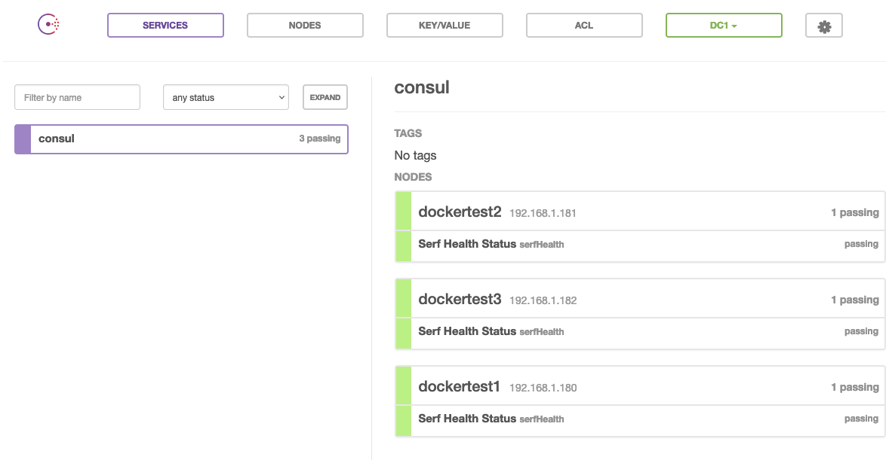
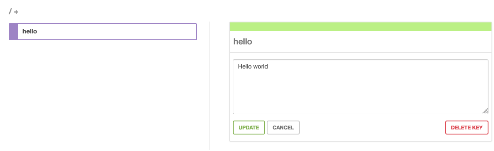

# Docker Consul (the easy way)

Unfortunately the documentation for Consule is not for humans to understand, the git repo is no in legacy (https://github.com/gliderlabs/docker-consul/tree/legacy), and it is still not great, and it is old.

There is a very good youtube introduction which shows how to get it to work: [Getting Started with Consul in Docker with DigitalOcean cloud](https://www.youtube.com/watch?v=tsdtBLeXMYY)


### Quick steps

#### On Node 1
```sh
PUBLIC_IP="$(hostname --all-ip-addresses | awk '{print $1}')"
$(docker run --rm progrium/consul cmd:run $PUBLIC_IP -it)
```

#### On Node 2, 3, 4....
```sh
PUBLIC_IP="$(hostname --all-ip-addresses | awk '{print $1}')"
JOIN_IP="node1 - PUBLIC_IP"
$(docker run --rm progrium/consul cmd:run $PUBLIC_IP::$JOIN_IP -it)
```

### WebUI

Per default the Consul UI is running

**http://PUBLIC_IP:8500/ui**




### Run some tests

#### Keyvalue store

**Node 1**

Put a value in the key value store
```sh
curl $PUBLIC_IP:8500/v1/kv/hello -X PUT -d "Hello world"
```

**Node 2**

Get the value from the key value store
```
curl $PUBLIC_IP:8500/v1/kv/hello | jq '.[0].Value' | tr -d '"' | base64 -d
```

**Look at it using the UI**

