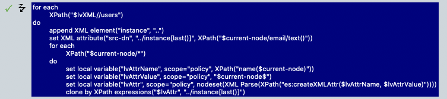

# JSON to XML (xds)

The NetIQ Rest Driver will return a status document which contains (in most cases) JSON, unfortunately NetIQ only have included a very specfic json2xds converter which only works with very few rest-end-points.

On the forums there have been some discussion on how to deal with this with many different solutions, this is what I found to work for me, and it is easy to deal with (kiss).

## json2xml.js 

### json2xml(jsonString, indent)
* Converting a JSON String (object & array) to a XML document
Wrapper around __json2xml(jsonObject, indent)

### __json2xml(jsonObject, indent)
* Convertin a JSON Object to an XML document


## Invocation
Create an local variable which holds the json data:

Example data in the status/return from the REST Driver:
```json
{
    "users": [
        {
            "commonName": "joedoe",
            "givenname": "Joe",
            "surname": "Doe",
            "email": "joe.doe@acme.com",
            "departmenet": "Firecrackers"
        },
        {
            "commonName": "jenslyn",
            "givenname": "Jens",
            "surname": "Lyn",
            "email": "jens.lyn@acme.com",
            "departmenet": "Super Heros"
        }
    ]
}
```


```xml
<do-set-local-variable name="jsonString" scope="policy">
    <arg-string>
        <token-xpath expression="$current-op/driver-operation-data/response/value/text()"/>
    </arg-string>
</do-set-local-variable>
```

As the code has a "slight" issue with & in the data, change them to html entities:
```xml
<do-set-local-variable name="jsonString" scope="policy">
    <arg-string>
        <token-replace-all regex="(\&amp;)" replace-with="&amp;amp;">
            <token-text xml:space="preserve">$jsonString$</token-text>
        </token-replace-all>
    </arg-string>
</do-set-local-variable>
```
Transform the JSON to XML:
```xml
<do-set-local-variable name="lvXML" scope="policy">
    <arg-node-set>
        <token-xml-parse>
            <token-xpath expression="es:json2xml($jsonString)"/>
        </token-xml-parse>
    </arg-node-set>
</do-set-local-variable>
```

The output will be something like:
```
<root>
    <user>
        <commonName>joedoe</commonName>
        <givenname>Joe</givenname>
        <surname>Doe</surname>
        <email>joe.doe@acme.com</email>
        <departmenet>Firecrackers</departmenet>
    </user>
</root>
```

Now you got an XML structure which you can transform into XDS, this is where the fun starts, as this part of the code is individual to the data received from the REST end-point.


## XML2XDS

Basically what you need to do is to loop through the ```<user>``` to get all the attributes (of which you have interest) and create instances for each ```<user>``` node. 

Meta code:
```
for each(lvXML//users)
    create new instance with src-dn

    for each($current-node/*) // we want each attribute (unless if we don't)
        attrname = name()
        attrvalue = $current-node
        add-element attr in instance
        add-value to element in instance
```
That's it.

To help me with that I to xmlhelper.js which contains ```createXMLAttr(attrName, attrValue)```, it does not do much, but it's quite helpful.

My code looks like (for the above example), which create instance nodes for each user in the input data.

(this could be prettier, much prettier)
```xml
<do-for-each>
    <arg-node-set>
        <token-xpath expression="$lvXML//users"/>
    </arg-node-set>
    <arg-actions>
        <do-append-xml-element expression=".." name="instance"/>
        <do-set-xml-attr expression="../instance[last()]" name="src-dn">
            <arg-string>
                <token-xpath expression="$current-node/email/text()"/>
            </arg-string>
        </do-set-xml-attr>
        <do-for-each>
            <arg-node-set>
                <token-xpath expression="$current-node/*"/>
            </arg-node-set>
            <arg-actions>
                <do-set-local-variable name="lvAttrName" scope="policy">
                    <arg-string>
                        <token-xpath expression="name($current-node)"/>
                    </arg-string>
                </do-set-local-variable>
                <do-set-local-variable name="lvAttrValue" scope="policy">
                    <arg-string>
                        <token-text xml:space="preserve">$current-node$</token-text>
                    </arg-string>
                </do-set-local-variable>
                <do-set-local-variable name="lvAttr" scope="policy">
                    <arg-node-set>
                        <token-xml-parse>
                            <token-xpath expression="es:createXMLAttr($lvAttrName, $lvAttrValue)"/>
                        </token-xml-parse>
                    </arg-node-set>
                </do-set-local-variable>
                <do-clone-xpath dest-expression="../instance[last()]" src-expression="$lvAttr"/>
            </arg-actions>
        </do-for-each>
    </arg-actions>
</do-for-each>
```




# Result (instances)

```xml
<input>
    ...
    <instance src-dn="joe.doe@acme.com">
      <attr attr-name="commonName">
        <value>joedoe</value>
      </attr>
      <attr attr-name="givenname">
        <value>Joe</value>
      </attr>
      <attr attr-name="surname">
        <value>Doe</value>
      </attr>
      <attr attr-name="email">
        <value>joe.doe@acme.com</value>
      </attr>
      <attr attr-name="departmenet">
        <value>Firecrackers</value>
      </attr>
    </instance>
    <instance src-dn="jens.lyn@acme.com">
      <attr attr-name="commonName">
        <value>jenslyn</value>
      </attr>
      <attr attr-name="givenname">
        <value>Jens</value>
      </attr>
      <attr attr-name="surname">
        <value>Lyn</value>
      </attr>
      <attr attr-name="email">
        <value>jens.lyn@acme.com</value>
      </attr>
      <attr attr-name="departmenet">
        <value>Super Heros</value>
      </attr>
    </instance>
  </input>
```