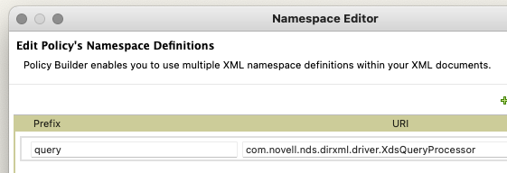

# XPath Stuff

XPath is one of these things you'll either endup hating or loving, but there is no way around it if you start working with NetIQ (now OpenText) Identity Manager, that is just how it is.

(I have to admit it took a bit before I got my head around it, and I am still learning).

[stackoverflow](https://stackoverflow.com) is a very good place to look for answeres.

This is just a collection of things I've done, it can be done smarter and prettier (no doubt about that), but it is a place to start - and a place for me to look when I forgot how to do something. 

## Evaluators

I've been using the xPath Evaluator in [Eclipse EE](https://www.eclipse.org/) for years, it works and it gives you 4 taps to work with. I normally just create a file with the nodeset I want to work with, then start writing in the xpath field (you might have to open the view: Window -> Show View -> Other -> XML -> XPath).

It can be a bit obnoxious with the node you have to select to get it to work.

## Howto's

### Is Group in 'Group Membership'
This is blantly stolen from a [Microfocus Community Post](https://community.microfocus.com/cyberres/netiq-identity-governance-administration/idm/w/identity_mgr_tips/3801/using-xpath-to-get-the-position-of-a-node-in-a-node-set).<br/>

If you need to see if a group is in the 'Group Membership' attribute then you can read the group, then loop through the nodes (entries) and then see if there is a hit. Or you can simply see if the entry you're looking for is there:

Create a GCV which has the DN of the group:

```xml
<definition critical-change="true" display-name="Entitlement Group" dn-space="dirxml" dn-type="slash" name="drv.entitlement.group" type="dn">
	<description/>
	<value>data\groups\test-group</value>
</definition>
```

Then do something like this:

a. Add the treename to the GroupDN
```xml
<do-set-local-variable name="lvGroupDN" notrace="true" scope="policy">
	<arg-string>
		<token-text xml:space="preserve">\~dirxml.auto.treename~\~drv.entitlement.group~</token-text>
	</arg-string>
</do-set-local-variable>
```

a1. Get the Current Group Membership
```xml
<do-set-local-variable name="lvGroupMembership" scope="policy">
	<arg-node-set>
		<token-attr name="Group Membership"/>
	</arg-node-set>
</do-set-local-variable>
```

b. See if the GroupDN is in the list of Groups
``` xml
<do-set-local-variable name="isGroup" scope="policy">
	<arg-string>
		<token-xpath expression="$lvGroupMembership[.=$lvGroupDN]"/>
	</arg-string>
</do-set-local-variable>
```

b1. Is the GroupDN is in the current operation
```xml
<do-set-local-variable name="isGroupAdded" scope="policy">
	<arg-string>
		<token-xpath expression='modify-attr[@attr-name="Group Membership"]/add-value/value[.=$lvGroupDN]'/>
	</arg-string>
</do-set-local-variable>
<do-set-local-variable name="isGroupRemoved" scope="policy">
	<arg-string>
		<token-xpath expression='modify-attr[@attr-name="Group Membership"]/remove-value/value[.=$lvGroupDN]'/>
	</arg-string>
</do-set-local-variable>
```

c. Test for it
```xml
<do-if>
	<arg-conditions>
		<and>
			<if-local-variable mode="regex" name="isGroup" op="equal">.+</if-local-variable>
		</and>
	</arg-conditions>
	<arg-actions/>
</do-if>
```

You can wrap the xpath expression in count() but as a user can only be a member of the same group once, it will either be there or not. And it's easier to test with '.+' than '$variable = 1 or 0'.


### Does User have an active association
I got the idea to this one from a ex colleague (consoluting), why you a a do-for-each when you can use XPath to do the heavy lifting.<br/>

We have the option to see if if the current user (current operation) has an association, but what if you just want to know if a user have an association. 

For example, if you need to do an operation on all the users which are a member of a group, and have an assocation. I often have that on the **ITP (status)** where we do not have much more information than what we send with the opation from the subscriber channel. 

a. First get the associations from the user.
```xml
<do-set-local-variable name="lvAssociationValues" scope="policy">
	<arg-node-set>
		<token-dest-attr name="DirXML-Associations">
			<arg-dn>
				<token-local-variable name="userDN"/>
			</arg-dn>
		</token-dest-attr>
	</arg-node-set>
</do-set-local-variable>
```

b. Then check for the association.<br/>
Remember the format of the Association value: &lt;volume>#&lt;nameSpace>#&lt;path>, we are intersted in the volume and nameSpace. So if the driverdn (volume) is there and the nameSpace is equal 1, then bingo, found.

Example value (from: [Microfocus Community](https://community.microfocus.com/cyberres/netiq-identity-governance-administration/idm/w/identity_mgr_tips/3321/using-xpath-to-examine-association-values))
```xml
<nds dtdversion="3.5" ndsversion="8.x">
	<source>
		<product version="3.5.11.20080307 ">DirXML</product>
		<contact>Novell, Inc.</contact>
	</source>
	<output>
		<instance class-name="User"
			qualified-src-dn="O=LAB\OU=EMPLOYEES\OU=NEW\CN=JSmith"
			src-dn="\ACME-LAB\LAB\EMPLOYEES\NEW\LJohnson1" src-entry-id="56795">
			<attr attr-name="DirXML-Associations">
				<value timestamp="1217007039#71" type="structured">
					<component name="nameSpace">1</component>
					<component name="volume">\ACME-LAB\LAB\SERVICES\IDVAULT\APP-JDBC</component>
					<component name="path">PK_SEQUENCE=350110,table=CLIENTS,schema=IDM</component>
				</value>
				<value timestamp="1217007039#72" type="structured">
					<component name="nameSpace">1</component>
					<component name="volume">\ACME-LAB\LAB\SERVICES\IDVAULT\LinuxUnixSettings</component>
					<component name="path">YE98 yxf3AGAleAAAwAAAA==</component>
				</value>
				<value timestamp="1217007039#73" type="structured">
					<component name="nameSpace">1</component>
					<component name="volume">\ACME-LAB\LAB\SERVICES\IDVAULT\UserApplication35</component>
					<component name="path">"AnAssociation"</component>
				</value>
				<value timestamp="1217007039#74" type="structured">
					<component name="nameSpace">1</component>
					<component name="volume">\ACME-LAB\LAB\SERVICES\IDVAULT\Active Directory</component>
					<component name="path">f0648eab27d6da4283246583112d6319</component>
				</value>
				<value timestamp="1217007039#75" type="structured">
					<component name="nameSpace">1</component>
					<component name="volume">\ACME-LAB\LAB\SERVICES\IDVAULT\Corporate Password Sync</component>
					<component name="path">E101738</component>
				</value>
			</attr>
		</instance>
	</output>
</nds>
```

We got the driverDN (otherwise use other means to obtain it), then we just need to check the that the nameSpace is 1.
```xml
<do-set-local-variable name="lvUserAssociation" scope="policy">
	<arg-node-set>
		<token-xpath expression="$lvAssociationValues[contains(., '~dirxml.auto.driverdn~' ) and contains(*[@name='nameSpace'],'1') ]/component[@name='path']/text()"/>
	</arg-node-set>
</do-set-local-variable>
```
Could be done nicer, but it works.

Cavelet: if the value is higher than 1, then this will not work and you need to figure that one out. 


### Get the qualified-dn of an object
By default the dn provided in an operation is a non-qualified (myorg\myou\myobject), where it can useful to have the qualified form (o=myorg\ou=myou\cn=myobject) for some operations (like convert to ldap).

This rule will set the qualified-src-dn if it does not exist.
```xml
<rule>
	<description>Get Qualified DN for Object</description>
	<conditions>
		<and>
			<if-xml-attr name="qualified-src-dn" op="not-available"/>
		</and>
	</conditions>
	<actions>
		<do-set-xml-attr expression="$current-op" name="qualified-src-dn">
			<arg-string>
				<token-xpath expression="query:readObject($srcQueryProcessor,'',$current-op/@src-dn,'','CN')[1]/@qualified-src-dn/>
			</arg-string>
		</do-set-xml-attr>
	</actions>
</rule>
```
This is the xPath expression:
```xml
query:readObject($srcQueryProcessor,'',$current-op/@src-dn,'','CN')[1]/@qualified-src-dn
```
It will use readObject to call the srcQueryProcessor to get the CN from the @src-dn (current operation), and from the result it will get the attribute:quarlifed-src-dn. 


Do remember to add the XML nameSpace for query: 
```xml
xmlns:query="http://www.novell.com/nxsl/java/com.novell.nds.dirxml.driver.XdsQueryProcessor"
```



(use the predefined -> query)

